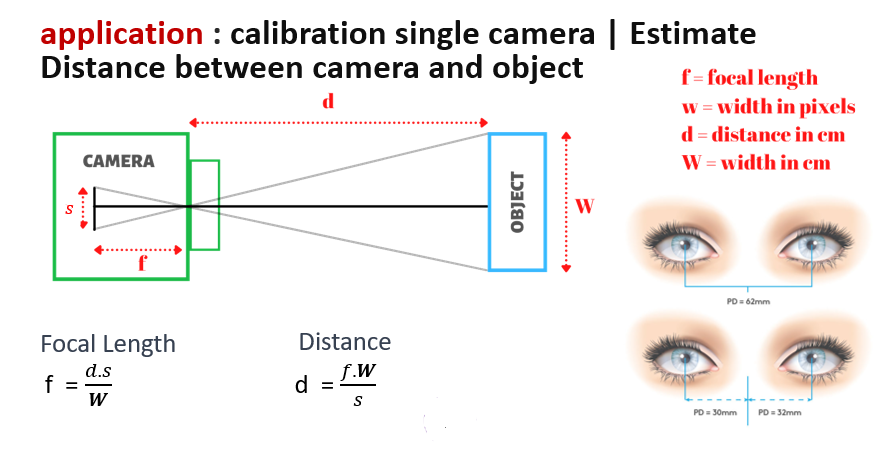
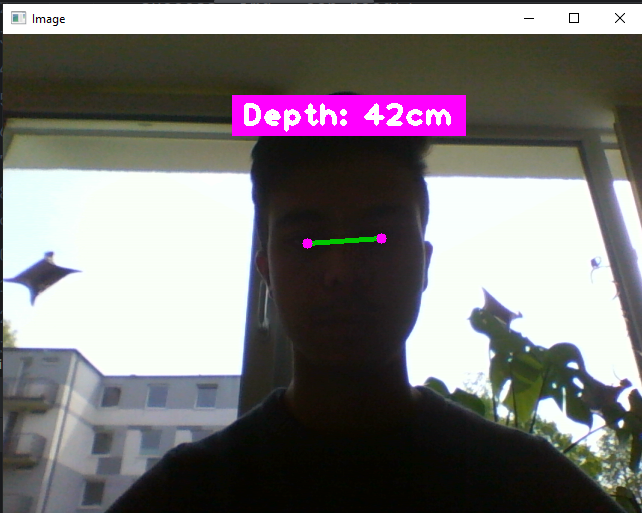
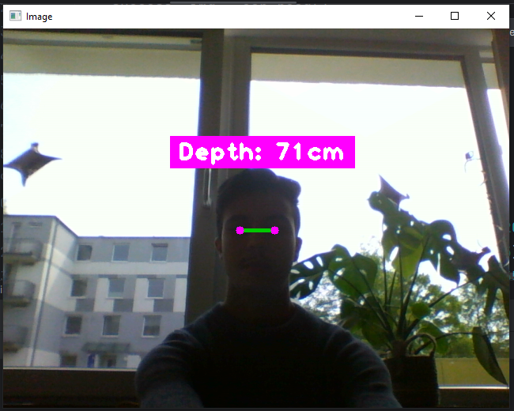

# StereoVision-DepthEstimation

The StereoVision-DepthEstimation project is a research-based implementation of stereo vision and camera calibration techniques for depth estimation. It utilizes computer vision algorithms to calculate the depth of an object in real-time using a webcam.

## Features

- Real-time depth estimation using stereo vision principles
- Facial feature detection and tracking using FaceMeshModule
- Display of calculated depth on the video stream

## Installation

1. Clone the repository:

git clone https://github.com/your-username/StereoVision-DepthEstimation.git

2. Install the dependencies:

pip install -r requirements.txt

## Usage

1. Run the main script:
2. A video stream will open showing the webcam feed.
3. Ensure that your face is properly visible within the frame.
4. The depth estimation will be displayed on the video stream.

## Contributing

Contributions to the StereoVision-DepthEstimation project are always welcome. If you find any issues or have suggestions for improvements, please feel free to open an issue or submit a pull request.

## Acknowledgments

- [cvzone](https://github.com/cvzone/cvzone) - OpenCV-based Python library for computer vision tasks
- [FaceMeshModule](https://github.com/cvzone/cvzone/tree/main/Self%20Projects/Face%20Landmarks) - FaceMeshModule from cvzone library for facial feature detection and tracking

## Resuls:
   

